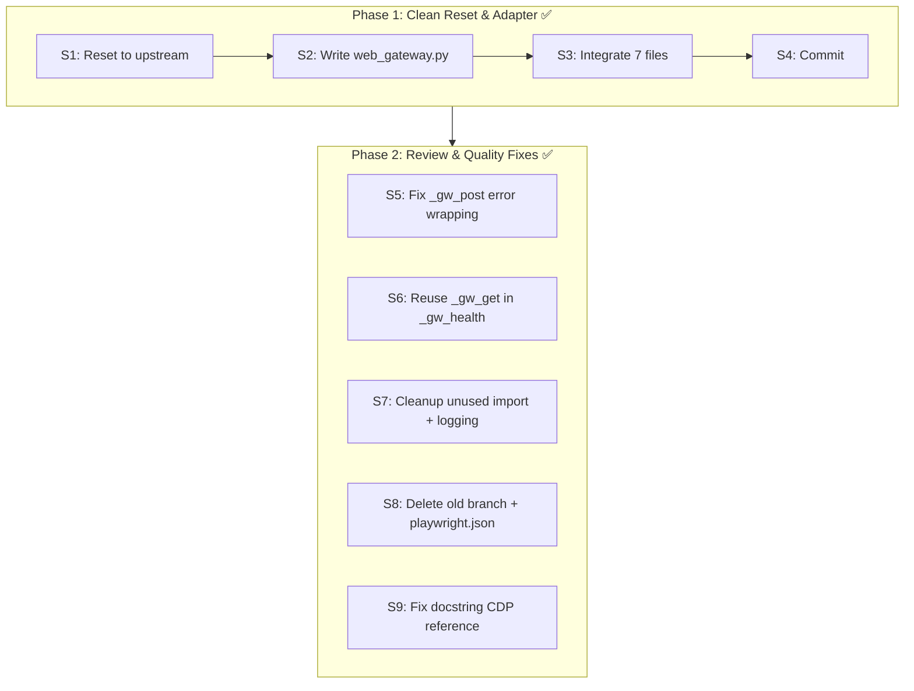

# Task Dependency Graph — SRC Web Gateway Adapter

```mermaid
graph TD
    subgraph Phase1 [Phase 1: Clean Reset & Adapter ✅]
        S1[S1: Reset to upstream]
        S2[S2: Write web_gateway.py]
        S3[S3: Integrate 7 files]
        S4[S4: Commit]
        S1 --> S2 --> S3 --> S4
    end

    subgraph Phase2 [Phase 2: Review & Quality Fixes ✅]
        S5[S5: Fix _gw_post error wrapping]
        S6[S6: Reuse _gw_get in _gw_health]
        S7[S7: Cleanup unused import + logging]
        S8[S8: Delete old branch + playwright.json]
        S9[S9: Fix docstring CDP reference]
    end

    Phase1 --> Phase2
```
